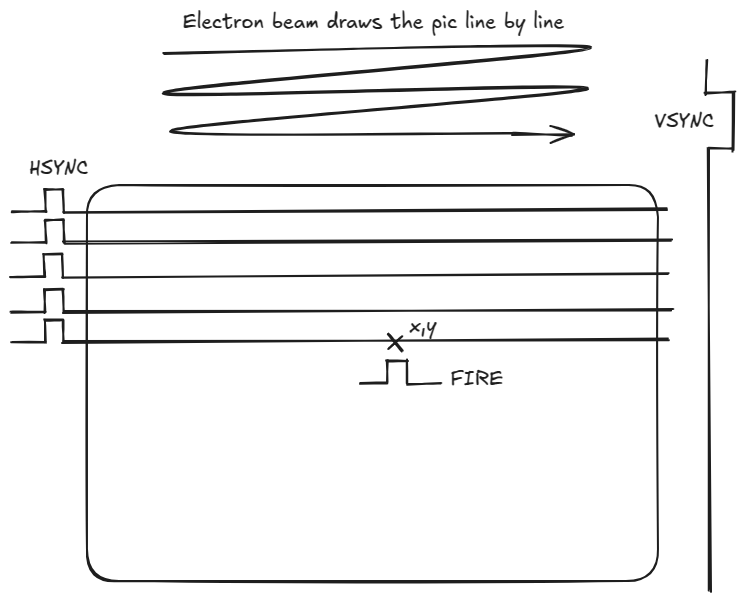

# BeamZapper

Wiimote (Wii game controller) adapter for Commodore 64 light pen/gun interface.

Wiimote infrared sensor works as the lighpen, so you need an wii IR bar or IR led or a candle.
Button A is the lighpen button, same as joy up.
Button B is the normal fire button and it prevents the lightpen function.
Direction buttons work as normal joystick directions.

Parts
 * esp32 or esp32-s3
 * LM1881 composite sync separator
 * 5V-to-3.3V level shifter * 8
 * 2 resistors and a capacitor
 * IR-led
 * wires, connectors, breadboard etc.

Credits
 * Contains mutilated CWIID library (wiimote message decoding parts)
 * See https://www.ti.com/lit/ds/symlink/lm1881.pdf

See https://gitlab.com/ricardoquesada/bluepad32 for complete wireless gamepad solution.
(That project is not related in any way)

TODO
 * See https://www.lemon64.com/forum/viewtopic.php?t=82449 and implement pot x and pot y
   Will run out of level-shifter channels. Change vsync or hsync to resistor divider.
 * Implement motion detection (Study HMM, DTW, MLP, etc.)